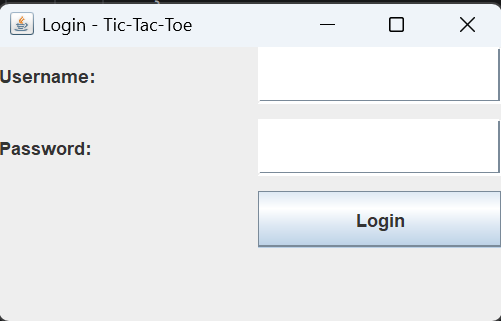
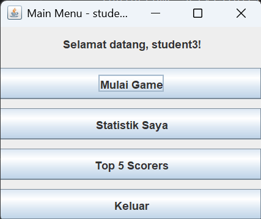
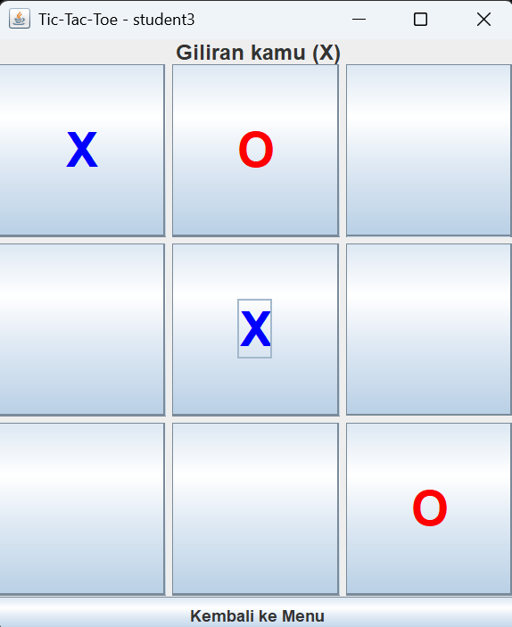
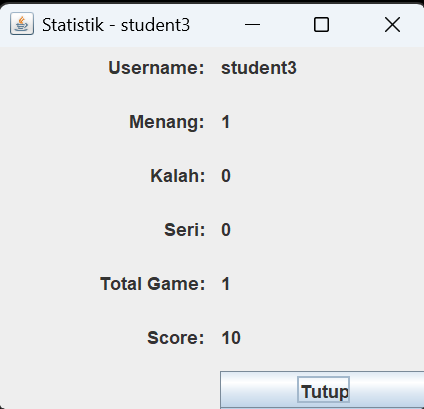
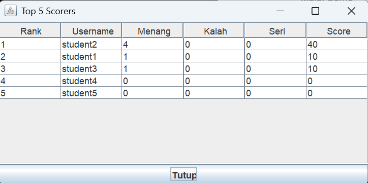

# Simple Tic-Tac-Toe Game with Java Swing, Login, and Statistics

## Student Information

- **Name:** Ahmad Raffi Athalla
- **Student ID (NRP):** 5026251085
- **Class:** E

---

## Project Description

This project is a simple Tic-Tac-Toe game developed using Java Swing as the graphical user interface. The application allows users to log in using data stored in a MySQL database, play against the computer, automatically record game statistics, display personal statistics, and show the Top 5 scorers based on the highest scores.

---

## Features

- User login using MySQL database
- Play Tic-Tac-Toe against the computer
- Win, lose, and draw detection
- Automatic update of player statistics
- Display personal statistics
- Display Top 5 scorers using JTable
- User-friendly Java Swing interface

---

## Technologies Used

- Java
- Java Swing
- JDBC
- MySQL
- IntelliJ IDEA
- Git
- GitHub

---

## Database

**Database Name**

```text
game_project
```

**Table**

```text
players
```

Columns:

| Column | Description |
|---------|-------------|
| id | Player ID |
| username | Username |
| password | Password |
| wins | Total wins |
| losses | Total losses |
| draws | Total draws |
| score | Total score |

The SQL schema is available in:

```text
database/schema.sql
```

---

## How to Run

1. Clone this repository.

```bash
git clone https://github.com/GodOfCode-lab/simple-tictactoe-game.git
```

2. Create a MySQL database named:

```text
game_project
```

3. Execute:

```text
database/schema.sql
```

4. Add MySQL JDBC Connector to the project.

5. Configure the database connection inside:

```text
DatabaseManager.java
```

Example:

```java
private static final String URL = "jdbc:mysql://localhost:3306/game_project";
private static final String USER = "root";
private static final String PASSWORD = "";
```

6. Build the project.
7. Run:

```text
Main.java
```

---

## Project Structure

```text
simple-tictactoe-game
│
├── src
│   ├── Main.java
│   ├── DatabaseManager.java
│   ├── Player.java
│   ├── PlayerService.java
│   ├── GameLogic.java
│   ├── LoginFrame.java
│   ├── MainMenuFrame.java
│   ├── GameFrame.java
│   ├── StatisticsFrame.java
│   └── TopScorersFrame.java
├── database
│   └── schema.sql
├── screenshots
│   ├── login.png
│   ├── main-menu.png
│   ├── game.png
│   ├── statistics.png
│   └── top5.png
├── README.md
└── .gitignore

```

---

## Class Explanation

### Main.java

Starts the application by opening the Login Window.

### DatabaseManager.java

Handles the JDBC connection to the MySQL database.

### Player.java

Represents the player object and stores player information such as username, wins, losses, draws, and score.

### PlayerService.java

Handles player login, updates player statistics after each game, and retrieves the Top 5 scorers from the database.

### GameLogic.java

Implements the Tic-Tac-Toe game logic, including move validation, winner detection, draw detection, and computer moves.

### LoginFrame.java

Provides the login interface for users to enter their username and password.

### MainMenuFrame.java

Displays the main menu and allows users to navigate to the game, statistics, Top 5 scorers, or exit the application.

### GameFrame.java

Displays the Tic-Tac-Toe board and manages user interaction during gameplay.

### StatisticsFrame.java

Displays the current player's statistics.

### TopScorersFrame.java

Displays the Top 5 players sorted by score using JTable.

---

## Screenshots

### Login Window



---

### Main Menu



---

### Game Window



---

### Statistics Window



---

### Top 5 Scorers



---

## Scoring System

| Result | Score |
|---------|------:|
| Win | +10 |
| Draw | +3 |
| Lose | +0 |

---

## Repository

GitHub Repository:

https://github.com/GodOfCode-lab/simple-tictactoe-game


---

## Demonstration Video

YouTube:

https://youtu.be/B86xPl9mOOE

---

## Author

**Ahmad Raffi Athalla**

Information Systems Undergraduate Student

Institut Teknologi Sepuluh Nopember (ITS)